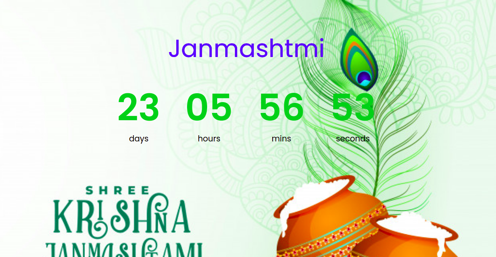

```
<p>Click the first button to alert "Hello" after waiting 3 seconds.</p>
<p>Click the second button to prevent the first function to execute. (You must click it before the 3 seconds are up.)</p>

<button onclick="myFunction()">Try it</button>
<button onclick="myStopFunction()">Stop the alert</button>

<script>
var myVar;

function myFunction() {
  myVar = setTimeout(function(){ alert("Hello"); }, 3000);
}

function myStopFunction() {
  clearTimeout(myVar);
}
</script>
```
# set Timeout 

The clearTimeout() method clears a timer set with the setTimeout() method.

The ID value returned by setTimeout() is used as the parameter for the clearTimeout() method.

myVar = setTimeout("javascript function", milliseconds);
Then, if the function has not already been executed, you will be able to stop the execution by calling the clearTimeout() method.

# set Interval

The setInterval() method calls a function or evaluates an expression at specified intervals (in milliseconds).

The setInterval() method will continue calling the function until clearInterval() is called, or the window is closed.

The ID value returned by setInterval() is used as the parameter for the clearInterval() method.

Tip: 1000 ms = 1 second.


